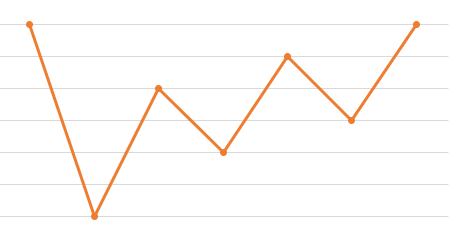

**这道题解决方式有多种思路，刚开始想的是，买的股票，什么时候卖出能获得最大收益，陷入了这个一个误区，实际上，我们并不需要知道什么时候这支买入的股票什么时候卖出才能获得最大收益。比如，第一天买的股票，
第二天增值了，第三天也增值了，那么我们可以第一天买入，第三天卖出。这个动作可以拆分为：第一天买入，第二天卖出，第二天买入，第三天卖出.这个一个过程。 
从这里可以引入贪心算法思想：在对问题求解时，总是做出在当前看来是最好的选择。也就是说，不从整体最优上加以考虑，算法得到的是在某种意义上的局部最优解。
那么这道题，用贪心算法来做的话，可以想为：我们一天一天的看，只要是上涨的，我们就记录上涨的数值，最后这些上涨的数值和，也就是最高盈利了。**

用个图来看的话，实际上这道题就是： 求上升区间的和.

### 下面是这道题的其他解法：

参考 [leetCode解答][https://leetcode-cn.com/problems/best-time-to-buy-and-sell-stock-ii/solution7/tan-xin-suan-fa-by-liweiwei1419-2/]

#### 1.暴力搜索

#### 2.动态规划（通用）

#### 3.贪心算法（针对这道问题的特殊解法）

